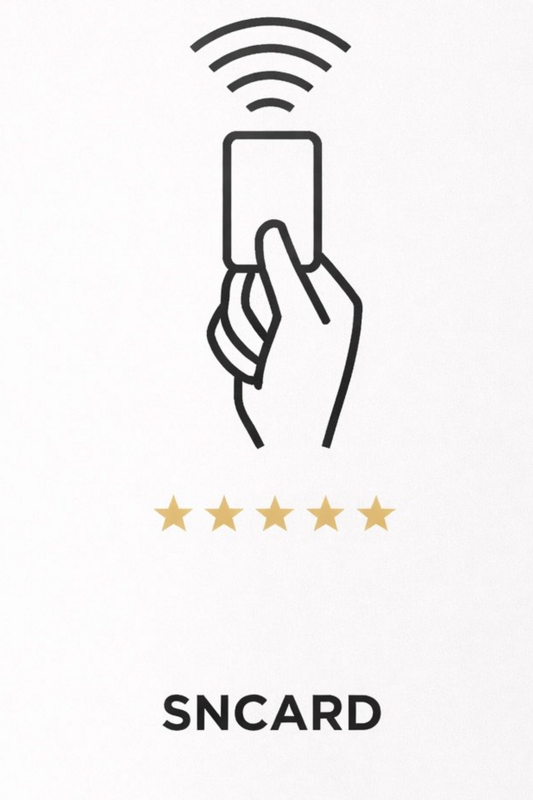

<div align="center">


# SNCard — La carte NFC qui booste vos avis Google

**Approchez. Notifiez. Collectez.**

[](https://nextjs.org/)
[](https://react.dev/)
[](https://www.typescriptlang.org/)
[](https://threejs.org/)
[](https://tailwindcss.com/)
[](https://stripe.com/)

[](https://sncard.fr)
[]()
[](https://sncard.fr)

---

*Une solution NFC clé en main permettant aux commerçants de collecter des avis Google sans effort. Le client tape sa carte, reçoit une notification et laisse un avis en quelques secondes.*

[Voir le site](https://sncard.fr) · [Commander](https://sncard.fr/commander)

</div>

---

## Table des matières

- [Aperçu](#-aperçu)
- [Fonctionnalités](#-fonctionnalités)
- [Démonstration](#-démonstration)
- [Architecture technique](#-architecture-technique)
- [Stack technique](#-stack-technique)
- [Structure du projet](#-structure-du-projet)
- [Installation](#-installation)
- [Variables d'environnement](#-variables-denvironnement)
- [Lancement](#-lancement)
- [Pages & Routes](#-pages--routes)
- [API Endpoints](#-api-endpoints)
- [Design System](#-design-system)
- [Carte 3D interactive](#-carte-3d-interactive)
- [Paiement Stripe](#-paiement-stripe)
- [SEO & Performance](#-seo--performance)
- [Déploiement](#-déploiement)
- [Roadmap](#-roadmap)
- [Contact](#-contact)

---

## Aperçu

<div align="center">

```
┌─────────────────────────────────────────────────────────────────┐
│                                                                 │
│   Le commerçant approche     Le client reçoit     Il laisse     │
│   la carte NFC du            une notification     un avis       │
│   téléphone client           instantanée          Google        │
│                                                                 │
│        📱 ← 💳                    🔔                  ⭐⭐⭐⭐⭐    │
│                                                                 │
│   ─────── Étape 1 ───────  ─── Étape 2 ───  ──── Étape 3 ──── │
│                                                                 │
└─────────────────────────────────────────────────────────────────┘
```

</div>

**SNCard** est une solution NFC innovante destinée aux commerçants. Une simple carte physique, au format carte bancaire (portrait), permet de collecter automatiquement des avis Google auprès de vos clients.

### Chiffres clés

| Métrique | Valeur |
|----------|--------|
| Commerçants satisfaits | **500+** |
| Note de satisfaction | **4.9 / 5** |
| Délai de traitement | **48 heures** |
| Livraison | **2-4 jours ouvrés** |

### Comment ça marche ?

1. **Approchez** — Le commerçant approche la carte SNCard du téléphone du client après un achat
2. **Notifiez** — Le client reçoit instantanément une notification sur son smartphone (sans application)
3. **Collectez** — Le client est redirigé vers la page Google Business pour laisser un avis

> Compatible iPhone XS+ et la plupart des appareils Android avec NFC.

---

## Fonctionnalités

### Site Vitrine

- Landing page premium avec animations fluides (Framer Motion + GSAP)
- **Carte NFC en 3D interactive** rendue en temps réel avec Three.js / React Three Fiber
- Effets parallaxe, scroll reveal, et fond Aurora animé
- Smooth scrolling via Lenis
- Sections : Hero, Comment ça marche, Bénéfices, Cas d'usage, Produit, Tarifs, FAQ
- Design responsive (mobile-first)
- Score WebGL adaptatif selon les capacités GPU du device

### E-Commerce

- Sélection de quantité avec tarification dégressive (6 paliers)
- Intégration **Stripe Checkout** pour le paiement sécurisé
- Page de confirmation post-achat avec prochaines étapes
- Réassurance : livraison rapide, support réactif, facture, paiement sécurisé

### SEO & Légal

- Sitemap XML dynamique
- Robots.txt configuré
- Balises OpenGraph et Twitter Cards
- Pages légales complètes : Mentions légales, CGV, Politique de confidentialité (RGPD)

---

## Démonstration

### Carte SNCard — Design

<div align="center">

| Face Avant | Face Arrière |
|:-:|:-:|
|  |  |

</div>

### Architecture des pages

```
🏠 Landing Page (/)
├── 🦸 Hero — Titre accrocheur + Carte 3D animée + CTA
├── ⚙️ Comment ça marche — 3 étapes illustrées
├── 💎 Bénéfices — Grille Bento (6 avantages)
├── 🏪 Cas d'usage — 6 secteurs d'activité
├── 📦 Détails Produit — Spécifications techniques
├── 💰 Tarifs — 6 paliers avec badge "Meilleur choix"
├── ❓ FAQ — 8 questions/réponses
└── 🚀 CTA Final — Appel à l'action avec gradient

🛒 Page Commander (/commander)
├── Sélecteur de quantité
├── Résumé de commande avec économies
├── Bouton Checkout Stripe
└── Réassurance (livraison, support, facture, sécurité)

✅ Confirmation (/confirmation)
📋 Mentions Légales (/mentions-legales)
🔒 Politique de Confidentialité (/politique-confidentialite)
📄 CGV (/cgv)
```

---

## Architecture technique

```
                    ┌──────────────────────┐
                    │     Client Browser    │
                    │   (Next.js App Router)│
                    └──────────┬───────────┘
                               │
                    ┌──────────▼───────────┐
                    │    Vercel Edge CDN    │
                    │   (SSR + Static Gen)  │
                    └──────────┬───────────┘
                               │
              ┌────────────────┼────────────────┐
              │                │                 │
    ┌─────────▼──────┐ ┌──────▼──────┐ ┌───────▼───────┐
    │  Next.js Pages │ │  API Routes │ │  Static Assets│
    │  (React 19 SSR)│ │ /api/checkout│ │  (Images, 3D) │
    │                │ │ /api/webhook │ │               │
    └────────────────┘ └──────┬──────┘ └───────────────┘
                              │
                    ┌─────────▼─────────┐
                    │   Stripe API      │
                    │  (Checkout + WH)  │
                    └───────────────────┘
```

---

## Stack technique

### Core

| Technologie | Version | Rôle |
|-------------|---------|------|
| [Next.js](https://nextjs.org/) | 16.1.6 | Framework React full-stack (App Router) |
| [React](https://react.dev/) | 19.2.3 | Bibliothèque UI |
| [TypeScript](https://www.typescriptlang.org/) | 5.x | Typage statique |
| [Tailwind CSS](https://tailwindcss.com/) | 4.x | Framework CSS utilitaire |

### 3D & Animations

| Technologie | Version | Rôle |
|-------------|---------|------|
| [Three.js](https://threejs.org/) | 0.183 | Moteur de rendu 3D WebGL |
| [React Three Fiber](https://docs.pmnd.rs/react-three-fiber) | 9.5 | Renderer React pour Three.js |
| [React Three Drei](https://github.com/pmndrs/drei) | 10.7 | Helpers et abstractions 3D |
| [Framer Motion](https://www.framer.com/motion/) | 12.34 | Animations déclaratives React |
| [GSAP](https://greensock.com/gsap/) | 3.14 | Animations avancées |
| [Lenis](https://lenis.darkroom.engineering/) | 1.3 | Smooth scroll |

### E-Commerce & State

| Technologie | Version | Rôle |
|-------------|---------|------|
| [Stripe](https://stripe.com/) | 20.3 | Paiement en ligne (server + client) |
| [Zustand](https://zustand-demo.pmnd.rs/) | 5.0 | State management léger |

### Utilitaires

| Technologie | Rôle |
|-------------|------|
| [Lucide React](https://lucide.dev/) | Icônes SVG |
| [clsx](https://github.com/lukeed/clsx) | Classnames conditionnels |
| Google Fonts (Inter, Plus Jakarta Sans) | Typographies |

---

## Structure du projet

```
sncard/
├── public/
│   ├── images/
│   │   ├── card/
│   │   │   ├── front.png          # Texture face avant de la carte
│   │   │   ├── back.png           # Texture face arrière de la carte
│   │   │   ├── TEMPLATE_FRONT.png # Template design face avant
│   │   │   └── TEMPLATE_BACK.png  # Template design face arrière
│   │   ├── logo.png               # Logo SNCard
│   │   └── logo-white.png         # Logo SNCard (blanc)
│   └── svgs/                      # Icônes SVG
│
├── src/
│   ├── app/
│   │   ├── layout.tsx             # Layout racine (fonts, metadata, providers)
│   │   ├── page.tsx               # Page d'accueil (landing)
│   │   ├── globals.css            # Design tokens CSS + animations Aurora
│   │   ├── robots.ts              # Configuration robots.txt
│   │   ├── sitemap.ts             # Génération sitemap XML
│   │   │
│   │   ├── api/
│   │   │   ├── checkout/          # POST — Création session Stripe Checkout
│   │   │   └── webhook/           # POST — Webhook Stripe (payment events)
│   │   │
│   │   ├── commander/             # Page de commande
│   │   ├── confirmation/          # Page de confirmation post-achat
│   │   ├── mentions-legales/      # Mentions légales
│   │   ├── politique-confidentialite/  # Politique de confidentialité
│   │   └── cgv/                   # Conditions générales de vente
│   │
│   ├── components/
│   │   ├── layout/
│   │   │   ├── Navbar.tsx         # Barre de navigation fixe
│   │   │   ├── Footer.tsx         # Pied de page
│   │   │   └── SmoothScroll.tsx   # Provider Lenis smooth scroll
│   │   │
│   │   ├── home/
│   │   │   ├── HeroSection.tsx    # Section hero avec carte 3D
│   │   │   ├── HowItWorks.tsx     # Comment ça marche (3 étapes)
│   │   │   ├── Benefits.tsx       # Bénéfices (grille Bento)
│   │   │   ├── UseCases.tsx       # Cas d'usage (6 secteurs)
│   │   │   ├── ProductDetails.tsx # Détails produit
│   │   │   ├── Pricing.tsx        # Grille tarifaire
│   │   │   ├── FAQ.tsx            # Questions fréquentes
│   │   │   └── CTASection.tsx     # Call-to-action final
│   │   │
│   │   ├── card3d/
│   │   │   ├── CardScene.tsx      # Canvas Three.js + responsive
│   │   │   ├── CardModel.tsx      # Mesh 3D de la carte (textures, matériaux)
│   │   │   └── CardEnvironment.tsx # Éclairage et environnement 3D
│   │   │
│   │   ├── order/
│   │   │   ├── QuantitySelector.tsx # Sélection de quantité
│   │   │   ├── OrderSummary.tsx     # Résumé de commande
│   │   │   ├── CheckoutButton.tsx   # Bouton paiement Stripe
│   │   │   └── Reassurance.tsx      # Éléments de réassurance
│   │   │
│   │   └── shared/
│   │       ├── Button.tsx         # Bouton multi-variant
│   │       ├── Badge.tsx          # Badge (default/highlight/premium)
│   │       ├── AnimatedSection.tsx # Wrapper animation au scroll
│   │       ├── TextReveal.tsx     # Animation de révélation de texte
│   │       ├── Toast.tsx          # Notifications toast
│   │       ├── AuroraBackground.tsx # Fond animé gradient
│   │       ├── Skeleton.tsx       # Placeholder de chargement
│   │       └── WebGLFallback.tsx  # Fallback si WebGL non supporté
│   │
│   ├── data/
│   │   ├── siteConfig.ts         # Configuration du site
│   │   ├── pricing.ts            # Paliers tarifaires
│   │   ├── benefits.ts           # Liste des bénéfices
│   │   ├── faq.ts                # Questions/réponses FAQ
│   │   ├── useCases.ts           # Cas d'usage par secteur
│   │   └── navigation.ts         # Items de navigation
│   │
│   ├── hooks/
│   │   ├── useScrollSection.ts   # Détection de section active
│   │   ├── useMediaQuery.ts      # Responsive breakpoints
│   │   ├── useReducedMotion.ts   # Accessibilité motion
│   │   └── useDeviceCapability.ts # Détection capacités GPU
│   │
│   ├── lib/
│   │   ├── utils.ts              # Utilitaires (cn, formatPrice)
│   │   └── stripe.ts             # Client Stripe
│   │
│   └── types/
│       └── index.ts              # Interfaces TypeScript
│
├── next.config.ts                # Configuration Next.js
├── tailwind.config.ts            # Configuration Tailwind CSS
├── tsconfig.json                 # Configuration TypeScript
├── package.json
└── README.md
```

---

## Installation

### Prérequis

- **Node.js** >= 18.18
- **npm** >= 9 (ou yarn / pnpm / bun)
- Un compte **[Stripe](https://dashboard.stripe.com/)** (mode test ou production)

### Étapes

```bash
# 1. Cloner le repository
git clone https://github.com/votre-username/sncard.git
cd sncard

# 2. Installer les dépendances
npm install

# 3. Configurer les variables d'environnement
cp .env.example .env.local
# Éditer .env.local avec vos clés (voir section suivante)

# 4. Lancer le serveur de développement
npm run dev
```

Le site est accessible sur **[http://localhost:3000](http://localhost:3000)**

---

## Variables d'environnement

Créer un fichier `.env.local` à la racine du projet :

```env
# ─── Site ────────────────────────────────────
NEXT_PUBLIC_SITE_URL=http://localhost:3000

# ─── Stripe ──────────────────────────────────
STRIPE_SECRET_KEY=sk_test_...
STRIPE_WEBHOOK_SECRET=whsec_...
NEXT_PUBLIC_STRIPE_PUBLISHABLE_KEY=pk_test_...

# ─── Email (V2 — optionnel) ─────────────────
# RESEND_API_KEY=re_...

# ─── Base de données (V2 — optionnel) ───────
# DATABASE_URL=postgresql://...
```

| Variable | Requis | Description |
|----------|:------:|-------------|
| `NEXT_PUBLIC_SITE_URL` | Oui | URL de base du site (metadata, redirections Stripe) |
| `STRIPE_SECRET_KEY` | Oui | Clé secrète Stripe (sk_test\_ ou sk_live\_) |
| `STRIPE_WEBHOOK_SECRET` | Oui | Secret pour la vérification des webhooks Stripe |
| `NEXT_PUBLIC_STRIPE_PUBLISHABLE_KEY` | Oui | Clé publique Stripe (pk_test\_ ou pk_live\_) |
| `RESEND_API_KEY` | Non | Clé API Resend pour les emails de confirmation (V2) |
| `DATABASE_URL` | Non | URL de connexion PostgreSQL (V2) |

---

## Lancement

```bash
# Développement (hot reload)
npm run dev

# Build de production
npm run build

# Serveur de production
npm start

# Lint du code
npm run lint
```

### Tester les webhooks Stripe en local

```bash
# Installer le CLI Stripe
# https://stripe.com/docs/stripe-cli

# Écouter les webhooks et les rediriger vers le serveur local
stripe listen --forward-to localhost:3000/api/webhook
```

---

## Pages & Routes

| Route | Page | Description |
|-------|------|-------------|
| `/` | Accueil | Landing page marketing avec carte 3D, sections vitrine |
| `/commander` | Commander | Sélection quantité, résumé, checkout Stripe |
| `/confirmation` | Confirmation | Page de succès post-paiement |
| `/mentions-legales` | Mentions légales | Informations légales de l'éditeur |
| `/politique-confidentialite` | Confidentialité | Politique RGPD, cookies, données |
| `/cgv` | CGV | Conditions générales de vente |

---

## API Endpoints

### `POST /api/checkout`

Crée une session Stripe Checkout.

**Request Body :**
```json
{
  "quantity": 25
}
```

**Response :**
```json
{
  "url": "https://checkout.stripe.com/c/pay/cs_..."
}
```

### `POST /api/webhook`

Réceptionne les événements Stripe (signature vérifiée).

**Événements gérés :**
- `checkout.session.completed` — Paiement réussi

---

## Design System

### Palette de couleurs

```
Fond principal      #0F172A  ████████  (Dark Slate)
Surface             #1E293B  ████████  (Slate 800)
Surface élevée      #334155  ████████  (Slate 700)
Texte principal     #F8FAFC  ████████  (Slate 50)
Texte secondaire    #94A3B8  ████████  (Slate 400)
Accent              #3B82F6  ████████  (Blue 500)
Accent clair        #60A5FA  ████████  (Blue 400)
Accent foncé        #2563EB  ████████  (Blue 600)
Succès              #10B981  ████████  (Emerald 500)
Erreur              #EF4444  ████████  (Red 500)
Warning             #F59E0B  ████████  (Amber 500)
```

### Gradients

| Nom | Valeur | Usage |
|-----|--------|-------|
| Brand | `blue → violet → pink (135deg)` | Hero, accents visuels |
| Button | `blue → dark blue + glow` | Boutons primaires |
| CTA | `blue → violet → purple` | Sections d'appel à l'action |

### Typographies

| Rôle | Police | Poids |
|------|--------|-------|
| Titres | Plus Jakarta Sans | 600, 700, 800 |
| Corps | Inter | 400, 500, 600 |

### Composants UI

| Composant | Variants | Description |
|-----------|----------|-------------|
| `Button` | primary / secondary / ghost × sm / md / lg | Bouton avec icônes et état loading |
| `Badge` | default / highlight / premium | Badge léger |
| `AnimatedSection` | up / down / left / right | Wrapper animation au scroll |
| `Toast` | success / error / info | Notification auto-dismiss (4s) |
| `Skeleton` | — | Placeholder de chargement |

---

## Carte 3D interactive

La pièce maîtresse du site : une carte NFC rendue en 3D avec **React Three Fiber**.

### Caractéristiques

- Rendu WebGL avec textures HD (face avant + arrière)
- **Matériaux physiques** : rugosité, métallicité, clearcoat pour un rendu réaliste
- **Éclairage professionnel** : lumières directionnelles + lightformers + environment map
- **Auto-rotation** avec contrôle orbital pour interaction manuelle
- **Ombres de contact** sur les appareils haut de gamme
- **3 niveaux de qualité** adaptatifs selon le GPU :
  - `high` — Toutes les fonctionnalités (ombres, reflets, haute résolution)
  - `medium` — Reflets simplifiés
  - `low` — Rendu minimal optimisé
- **Fallback gracieux** si WebGL n'est pas supporté

### Architecture 3D

```
CardScene (Canvas wrapper)
├── CardModel (Mesh géométrique)
│   ├── Texture face avant (front.png)
│   ├── Texture face arrière (back.png)
│   └── Physical Material (roughness, metalness, clearcoat)
└── CardEnvironment
    ├── Directional Lights
    ├── Ambient Light
    └── Lightformers (reflets réalistes)
```

---

## Paiement Stripe

### Grille tarifaire

| Quantité | Prix unitaire | Total | Réduction |
|:--------:|:------------:|:-----:|:---------:|
| 1 carte | 29,90 € | 29,90 € | — |
| 5 cartes | 24,90 € | 124,50 € | -17% |
| 10 cartes | 21,90 € | 219,00 € | -27% |
| **25 cartes** | **18,90 €** | **472,50 €** | **-37%** |
| 50 cartes | 15,90 € | 795,00 € | -47% |
| 100 cartes | 12,90 € | 1 290,00 € | -57% |

> Le palier **25 cartes** est mis en avant comme "Meilleur choix".

### Flux de paiement

```
Sélection quantité → Résumé commande → Checkout Stripe → Webhook → Confirmation
       │                    │                 │              │            │
  QuantitySelector    OrderSummary     /api/checkout    /api/webhook   /confirmation
                                       (session)      (vérification)
```

---

## SEO & Performance

### SEO

- **Sitemap XML** généré dynamiquement (`/sitemap.xml`)
- **Robots.txt** configuré (`/robots.txt`)
- **Metadata** complètes : titre, description, OpenGraph, Twitter Cards
- **Locale** : `fr_FR`
- **URL canonique** via `NEXT_PUBLIC_SITE_URL`

### Optimisations performance

- **Images** : formats AVIF + WebP optimisés automatiquement par Next.js
- **3D adaptative** : détection GPU pour ajuster la qualité du rendu
- **Fallback WebGL** : UI alternative si WebGL n'est pas disponible
- **Smooth scroll** : Lenis avec durée de 1.2s et multiplicateur tactile
- **Animations accessibles** : respect de `prefers-reduced-motion`
- **Transpilation** : packages Three.js pré-transpilés dans le build

---

## Déploiement

### Vercel (recommandé)

```bash
# Via le CLI Vercel
npm i -g vercel
vercel
```

Ou connecter le repository GitHub directement depuis le [Dashboard Vercel](https://vercel.com/dashboard).

> Ne pas oublier de configurer les **variables d'environnement** dans les paramètres du projet Vercel.

### Webhook Stripe en production

1. Aller dans **Stripe Dashboard → Developers → Webhooks**
2. Ajouter un endpoint : `https://sncard.fr/api/webhook`
3. Sélectionner l'événement `checkout.session.completed`
4. Copier le **Webhook Secret** dans `STRIPE_WEBHOOK_SECRET`

---

## Roadmap

### MVP (actuel)

- [x] Landing page premium avec animations
- [x] Carte 3D interactive (Three.js / R3F)
- [x] Smooth scroll (Lenis)
- [x] Grille tarifaire avec 6 paliers
- [x] Checkout Stripe intégré
- [x] Page de confirmation
- [x] Pages légales (CGV, Mentions, Confidentialité)
- [x] SEO (Sitemap, Robots, OpenGraph)
- [x] Responsive mobile-first
- [x] Détection GPU adaptative

### V2 (prévu)

- [ ] Emails de confirmation automatiques (Resend)
- [ ] Base de données pour le suivi des commandes (PostgreSQL + Prisma)
- [ ] Dashboard admin (backoffice)
- [ ] Personnalisation des cartes (logo custom)
- [ ] Analytics (Plausible / GA4)
- [ ] CRM et gestion des avis
- [ ] Mode clair / sombre

---

## Secteurs ciblés

<div align="center">

| 🍽️ Restaurants | 💈 Barbiers | 💇 Salons de coiffure |
|:-:|:-:|:-:|
| 🔧 **Garages auto** | 🛍️ **Boutiques** | 🏨 **Hôtels** |

</div>

---

## Contact

<div align="center">

**SNCard** — *La carte NFC qui booste vos avis Google*

📧 [contact@sncard.fr](mailto:contact@sncard.fr) · 🌐 [sncard.fr](https://sncard.fr)

---

*Built with Next.js, React Three Fiber & Stripe*

</div>
